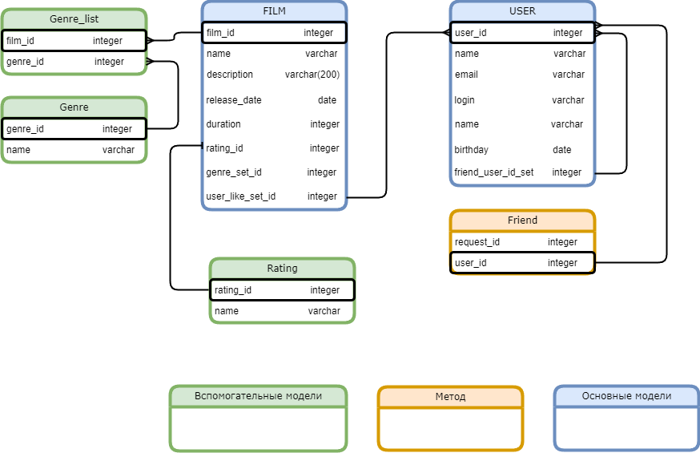

# Filmorate (Rest API)

## Описание проэкта
Бэкэнд (rest api) аналог кинопоиск.
Возможности:
- Оценки фильмов (Like);
- Получение популярных фильмов
- Искать фильм;
- Добавлять пользователей в друзья;
- Искать пользователя;

## Используемые технологии
- Java 11, Lombok;
- Spring Boot;
- SQL;
- Maven, Junit;
- Postman.

## DataBase

## Примеры запросов

- Получить таблицу пользователей:
~~~~ roomsql
SELECT * 
FROM user
ORDER BY id DESC
- ~~~~
- Получить пользователя по id: 
~~~~ roomsql
SELECT * 
FROM user 
WHERE user_id = ? , {id}
~~~~
- Получить друзей пользователя id:
~~~~roomsql
SELECT * 
FROM user AS us_id 
LEFT JOIN user AS us_friend ON us_id.user_id = us_friend.friend_user_id_set
ORDER BY name DESC
~~~~
- Получить таблицу фильмов: 
~~~~ roomsql
SELECT * 
FROM film
ORDER BY id DESC
~~~~
- Получить фильм по id:
~~~~ roomsql
  SELECT * 
  FROM film 
  WHERE film_id = ?, {id}
~~~~
- Получить топ фильмов:
~~~~ roomsql
  SELECT * 
  FROM film 
  ORDER BY user_like ASC
  LIMIT ? , {country}
~~~~