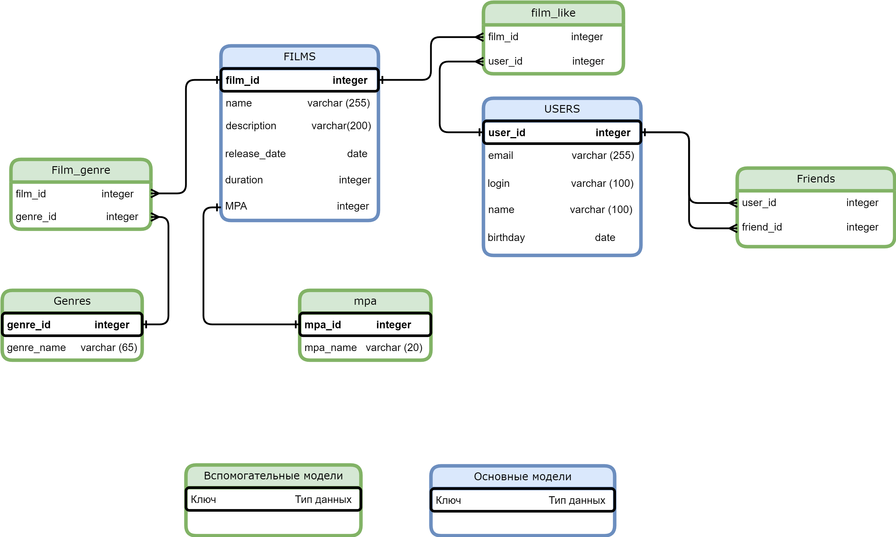

# Filmorate (Rest API)

## Описание
Бэкэнд (rest api) аналог кинопоиск.
Возможности:
- Оценки фильмов (Like);
- Получение популярных фильмов
- Искать фильм;
- Добавлять пользователей в друзья;
- Искать пользователя;

## Технологии
- Java 11, Lombok;
- Spring Boot;
- SQL;
- Maven, Junit;
- Postman.

## DataBase

## Примеры запросов

- Получить таблицу пользователей: SELECT * FROM user
- Получить пользователя по id: SELECT * FROM user WHERE user_id = {id}
- Получить друзей пользователя id: SELECT * FROM user AS us_id LEFT JOIN user AS us_friend ON us_id.user_id = us_friend.friend_user_id_set

- Получить таблицу фильмов: SELECT * FROM film
- Получить фильм по id: SELECT * FROM film WHERE film_id = {id}
